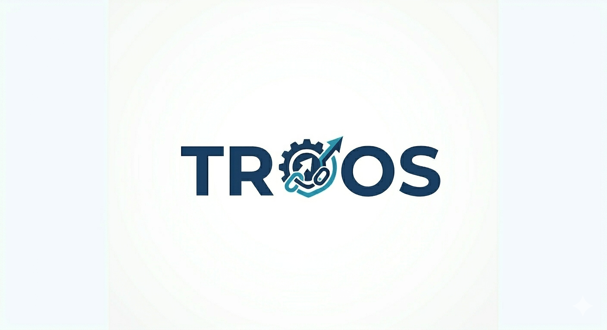

  
   
 

# ConsultIQ

**Team TROOS: ConsultIQ - A consultancy platform built to match the right consultants to the right projects.** 

### What is ConsultIQ?
ConsultIQ is an intelligent matching platform designed for consultancy firms. Using a configurable fit-scoring engine that weighs skills, availability, location, and cost-to-company, the platform surfaces a ranked shortlist of the ideal candidates for any given job. This is followed by a transparent breakdown of each candidate's score, taking the guesswork out of resource allocation.

  <!-- (c) Requirements Badge -->
  

  <!-- (b) Build Badge -->
  

  <!-- (a) Code Coverage Badge 
   -->

  <!-- (d) Issue Tracking Badge -->
  

  <!-- (e) Monitoring Badge 
  -->

---

## Git Structure & Management

This repository is structured as a **Monorepo**, housing both the frontend client and the backend API in a single repository. This approach simplifies dependency management, allows for shared TypeScript interfaces, and streamlines CI/CD workflows.

* `apps/frontend/` - Contains the React/Vite web dashboard.
* `apps/backend/` - Contains the NestJS API and PostgreSQL database schemas.
* `.github/workflows/` - Contains our GitHub Actions scripts for automated testing and CI/CD.

## Branching Strategy

Our team follows a structured Git Flow strategy to maintain high code quality and prevent build breaks on the main branch:

* `main`: Production-ready, stable code. All merges require PR approvals and passing CI builds.
* `develop`: The primary integration branch for the next release.
* `feature/*`: Used for developing new features (e.g., `feature/fit-scoring-engine`). Branches off `develop`.
* `bugfix/*` or `hotfix/*`: Used for resolving bugs (e.g., `bugfix/auth-token-refresh`).

---

  <h2>Documentation</h2>

  <table>
    <thead>
      <tr>
        <th align="center">Resource</th>
      </tr>
    </thead>
    <tbody>
      <tr>
        <td align="center"><a href="...">Functional Requirements (SRS)</a></td>
      </tr>
      <tr>
        <td align="center"><a href="https://github.com/orgs/COS301-SE-2026/projects/66">TROOS Project Board</a></td>
      </tr>
    </tbody>
  </table>

   

  <h2>Meet the Team</h2>

  <table>
    <thead>
      <tr>
        <th align="left" width="15%">Name</th>
        <th align="left" width="60%">Profile Summary</th>
        <th align="center" width="25%">Links</th>
      </tr>
    </thead>
    <tbody>
      <tr>
        <td><b>Ofentse Modika</b></td>
        <td>I am a final-year BSc Computer Science student, motivated and goal-oriented in everything I pursue. I have a strong interest in cybersecurity, financial technology, and system architecture.</td>
        <td align="center">
           
          
        </td>
      </tr>
      <tr>
        <td><b>Siyabonga Sibiya</b></td>
        <td>As a Computer Science student, I enjoy exploring how technology can create smart, efficient solutions. My interests lie particularly in financial technology and the Internet of Things (IoT).</td>
        <td align="center">
           
          
        </td>
      </tr>
      <tr>
        <td><b>Onthatile Molebaloa</b></td>
        <td>My name is Onthatile Molebaloa, and I am a third-year BSc Computer Science student with a strong foundation in both front-end and back-end development. I create intuitive interfaces using React, HTML, CSS, and JavaScript, and build robust back-end systems with Node.js, Supabase, MySQL, MongoDB, Python, Java, and C++.</td>
        <td align="center">
           
          
        </td>
      </tr>
      <tr>
        <td><b>Tshireletso Sebake</b></td>
        <td>I am a final-year computer science student with experience in both frontend and backend development, working with technologies such as C++, Java, JavaScript, React, Next.js, NestJS, Go, and PostgreSQL.</td>
        <td align="center">
           
          
        </td>
      </tr>
      <tr>
        <td><b>Retshepile Nkwana</b></td>
        <td>I am a full-stack developer with a primary focus on backend development, experienced in Java, C#, .NET, and Node.js, with the strongest expertise in Java. I also contribute to frontend development using React and Next.js.</td>
        <td align="center">
           
          
        </td>
      </tr>
    </tbody>
  </table>

   

---

  <h2>Tech Stack</h2>

  <!-- Tech Stack Badges -->
  
  
  
  
  
  

    

  <!-- Tech Stack Table -->
  <table>
    <thead>
      <tr>
        <th align="left">Category</th>
        <th align="left">Technologies & Tools</th>
      </tr>
    </thead>
    <tbody>
      <tr>
        <td><b>Frontend & Web Dashboard</b></td>
        <td>React, TypeScript, Vercel (Hosting)</td>
      </tr>
      <tr>
        <td><b>Backend API</b></td>
        <td>NestJS (Node.js)</td>
      </tr>
      <tr>
        <td><b>Database & Caching</b></td>
        <td>PostgreSQL, Redis</td>
      </tr>
      <tr>
        <td><b>Infrastructure & Hosting</b></td>
        <td>AWS (Backend Hosting)</td>
      </tr>
      <tr>
        <td><b>CI/CD</b></td>
        <td>GitHub Actions</td>
      </tr>
      <tr>
        <td><b>Testing</b></td>
        <td>Jest, Supertest, React Testing Library</td>
      </tr>
    </tbody>
  </table>

