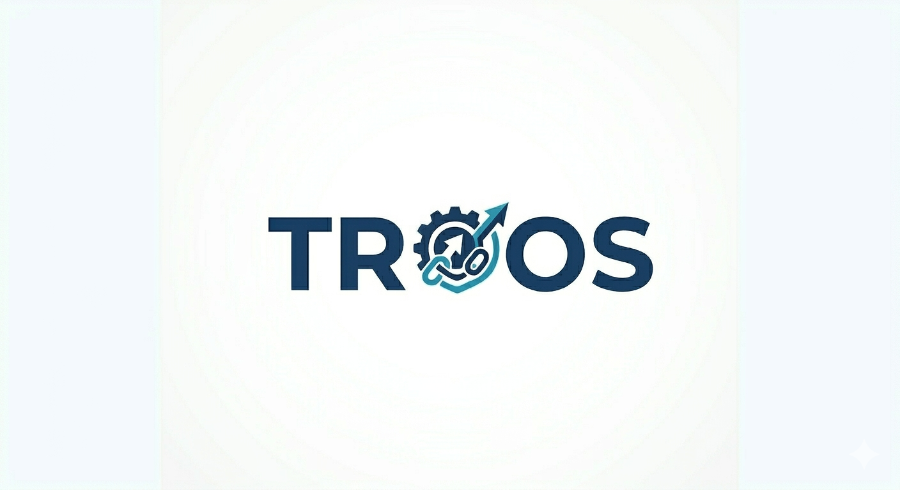

# ConsultIQ

**Team TROOS: ConsultIQ - A consultancy platform built to match the right consultants to the right projects.**

### What is ConsultIQ?
ConsultIQ is an intelligent matching platform designed for consultancy firms. Using a configurable fit-scoring engine that weighs skills, availability, location, and cost-to-company, the platform surfaces a ranked shortlist of the ideal candidates for any given job. This is followed by a transparent breakdown of each candidate's score, taking the guesswork out of resource allocation.

<div align="center">

  <a href="https://github.com/COS301-SE-2026/ConsultIQ/blob/main/Documents/SRS.pdf">
    
  </a>
  <a href="https://github.com/COS301-SE-2026/ConsultIQ/actions">
    
  </a>
  <a href="https://github.com/COS301-SE-2026/ConsultIQ/issues">
    
  </a>
  <a href="https://codecov.io/gh/COS301-SE-2026/ConsultIQ">
    
  </a>

</div>

---

This repository is structured as a **Monorepo**, housing both the frontend client and the backend API in a single repository. This approach simplifies dependency management, allows for shared TypeScript interfaces, and streamlines CI/CD workflows.

* `apps/frontend/` - Contains the React/Vite web dashboard.
* `apps/backend/` - Contains the NestJS API and PostgreSQL database schemas.
* `.github/workflows/` - Contains our GitHub Actions scripts for automated testing and CI/CD.

## Branching Strategy

Our team follows a structured Git Flow strategy to maintain high code quality and prevent build breaks on the main branch:

* `main`: Production-ready, stable code. All merges require PR approvals and passing CI builds.
* `develop`: The primary integration branch for the next release.
* `feature/*`: Used for developing new features (e.g., `feature/fit-scoring-engine`). Branches off `develop`.
* `bugfix/*` or `hotfix/*`: Used for resolving bugs (e.g., `bugfix/auth-token-refresh`).

---

<div align="center">

## Documentation
## Documentation

<details open>
<summary><strong>Demo 2</strong></summary>

<br>

| Resource |
|:---|
| [System Requirements Specification](https://github.com/COS301-SE-2026/ConsultIQ/blob/feature/documetation/Documents/Demo%202/SRS%20V2.pdf) |
| [System Architecture Specification](https://github.com/COS301-SE-2026/ConsultIQ/blob/feature/documetation/Documents/Demo%202/SAS%20(1).pdf) |
| [Coding Standards](https://github.com/COS301-SE-2026/ConsultIQ/blob/feature/documetation/Documents/Demo%202/Coding%20Standards_V2.pdf) |
| [Testing Policy](https://github.com/COS301-SE-2026/ConsultIQ/blob/feature/documetation/Documents/Demo%202/testing_policy%20(1).pdf) |
| [User Manual](https://github.com/COS301-SE-2026/ConsultIQ/blob/feature/documetation/Documents/Demo%202/User%20manual.pdf) |
| [Brand Style Guide](https://github.com/COS301-SE-2026/ConsultIQ/blob/feature/documetation/Documents/Demo%202/Brand%20Style%20Guide%20V2.pdf) |
| [Figma UI Panels](https://www.figma.com/design/S4Ydfuk6L0YkWhdjdRGxf9/High_fidelity_wireframes?node-id=0-1&p=f&t=m8cf3g1IC16ToRs4-0) |

</details>

<details>
<summary><strong>Demo 1</strong></summary>

<br>

| Resource |
|:---|
| [Functional Requirements (SRS)](https://github.com/COS301-SE-2026/ConsultIQ/blob/main/Documents/SRS.pdf) |
| [TROOS Project Board](https://github.com/orgs/COS301-SE-2026/projects/66) |


</details>
<br>

## Meet the Team

| Name | Role(s) | Profile Summary | Links |
|---|---|---|---|
| **Ofentse Modika** | Team Lead, Backend Engineer, DevOps Engineer | Final-year BSc Computer Science student, motivated and goal-oriented, with a strong interest in cybersecurity, financial technology, and system architecture. | [](https://github.com/Ofentse360) [](https://www.linkedin.com/in/ofentse-modika-b09126248) |
| **Siyabonga Sibiya** | Business Analyst, Database Engineer, Backend Engineer | Computer Science student who enjoys exploring how technology can create smart, efficient solutions, with interests in financial technology and IoT. | [](https://github.com/SiyaSibiya) [](http://www.linkedin.com/in/siyabonga-sibiya-086543237) |
| **Onthatile Molebaloa** | Database Engineer, Frontend Engineer | Third-year BSc Computer Science student with a strong foundation in front-end and back-end development, building interfaces with React, HTML, CSS, and JavaScript, and back-end systems with Node.js, Supabase, MySQL, MongoDB, Python, Java, and C++. | [](https://github.com/Onthatile-22659812) [](https://www.linkedin.com/in/onthatile-molebaloa-93a4642a8/) |
| **Tshireletso Sebake** | Frontend Engineer, DevOps Engineer | Final-year computer science student with experience in both frontend and backend development, working with C++, Java, JavaScript, React, Next.js, NestJS, Go, and PostgreSQL. | [](https://github.com/Ramatsobane29) [](https://www.linkedin.com/in/tshireletso-sebake-9b3397253/) |
| **Retshepile Nkwana** | Backend Engineer, DevOps Engineer, Data Analyst | Full-stack developer with a primary focus on backend development, experienced in Java, C#, .NET, and Node.js (strongest in Java), and also contributes to frontend development using React and Next.js. | [](https://github.com/RNkwana) [](https://www.linkedin.com/in/retshepile-nkwana-817297292/) |

<br>

## Tech Stack


<br><br>

| Category | Technologies & Tools |
| :--- | :--- |
| **Frontend & Web Dashboard** | React, TypeScript, Vercel (Hosting) |
| **Backend API** | NestJS (Node.js) |
| **Database & Caching** | PostgreSQL, Redis |
| **AI & Automation** | LangChain, Vercel AI SDK |
| **Infrastructure & Hosting** | AWS (Backend Hosting) |
| **CI/CD** | GitHub Actions |
| **Testing** | Jest, Supertest, React Testing Library |

</div>

## Live System

| Environment | URL |
|---|---|
| Production (Frontend) | https://consult-iq-red.vercel.app |


## Rollback Strategy

ConsultIQ uses image tag pinning for rollback. Every deployment produces two Docker image tags:
- `latest` / `staging` — the current deployed version
- `{commit-sha}` — a permanent reference to that exact build

**To roll back a failed production deployment:**

1. Find the last working commit SHA in the [GitHub Actions history](https://github.com/COS301-SE-2026/ConsultIQ/actions)
2. SSH into EC2:
   ```bash
   ssh -i consultiq-key.pem ubuntu@13.247.189.149
   ```
3. Edit the production compose file to pin to the previous SHA:
   ```bash
   nano /home/ubuntu/ConsultIQ/docker-compose.prod.yml
   ```
   Change:
   ```yaml
   image: ghcr.io/cos301-se-2026/consultiq-backend:latest
   ```
   To:
   ```yaml
   image: ghcr.io/cos301-se-2026/consultiq-backend:{previous-sha}
   ```
4. Redeploy:
   ```bash
   docker-compose -f docker-compose.prod.yml up -d
   ```

**To roll back staging**, follow the same steps using `docker-compose.staging.yml`.

## Environment Variables

See `backend/.env.example` and `frontend/.env.example` for required environment variables.

## Local Development with Docker

```bash
docker-compose up
```

This starts PostgreSQL, Redis, backend, and frontend together.

---

<div align="center">
  <table>
    <tr>
      <td align="center" width="50%">
        <p><strong>PROJECT LOGO: ConsultIQ</strong></p>
        
      </td>
      <td align="center" width="50%">
        <p><strong>TEAM LOGO: TROOS</strong></p>
        
      </td>
    </tr>
  </table>
</div>
